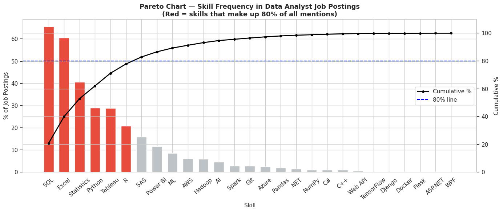

# Data Analytics Career Path & Salary Predictor 📊

## **Executive Summary**
This project identifies the most accessible entry points and highest growth potential industries for Data Analysts. By analyzing over 1,600 Glassdoor job postings, our team developed a predictive model to estimate salary benchmarks and identified key technical drivers of compensation in the current labor market.

## **The Strategic Problem**
While data analytics is a financially rewarding field, with senior analysts in Finance and IT earning between $130,000–$133,000 annually, many career pivoters struggle to identify which industries provide the best starting opportunities. Our research bridges this gap by quantifying industry accessibility and salary growth potential.

## **Key Visual: Industry Opportunity Analysis (Pareto)**
We utilized a Pareto Analysis to identify the "Vital Few" industries that dominate the job market, allowing candidates to prioritize their applications for maximum impact.

* **The 80/20 Rule:** Our analysis revealed that approximately 20% of industries—led by Health Care, Finance, and Information Technology—account for nearly 80% of high-paying job openings.
* **Actionable Insight:** For professionals transitioning from unrelated fields, targeting these "Top 20%" sectors provides the highest probability of securing a role with strong salary growth.

## **Technical Stack & Methodology**
* **Language:** Python (Pandas, Matplotlib, Seaborn)
* **Environment:** Jupyter Notebook
* **Data Source:** 1,600+ Glassdoor Job Postings
* **Modeling:** Regression analysis to estimate entry-level and senior-level salary benchmarks

## **Core Insights**
* **Salary Benchmarks:** Senior analysts with Python and SQL expertise consistently reach the top percentiles of the market.
* **Accessibility:** Data Analytics remains one of the most accessible high-paying fields, often requiring minimal prior experience for entry-level roles.
* **Future Trends:** Proficiency in AI-assisted workflows is an increasingly vital requirement in the 2026 job market.

## **Project Workflow**
1. **ETL & Cleaning:** Processed raw Glassdoor data, standardized salary estimates, and handled missing company ratings.
2. **Exploratory Data Analysis (EDA):** Correlated company revenue and size with salary offerings.
3. **Pareto Modeling:** Identified the concentration of opportunities to drive strategic career decisions.
4. **Predictive Analytics:** Built models to forecast salary outcomes based on industry and technical skill set.

## **Collaborators**
* **Pocholo Jimenez**
* **Reignelle Canasa**
* **Jake Pido**
* **Yanna Dee**
* **Keum Riman**
